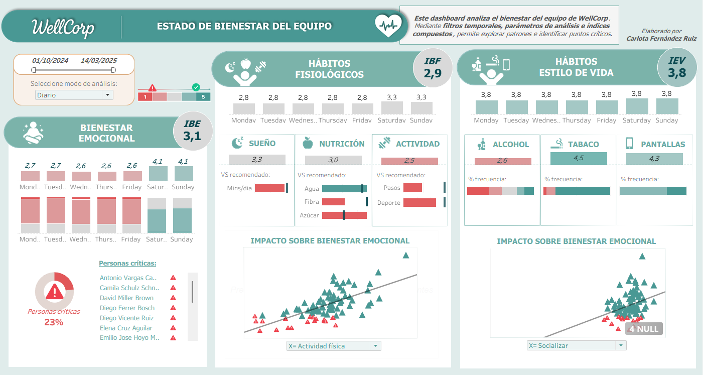

## 🏥 WellCorp – Employee Wellbeing Dashboard

This project analyzes the overall wellbeing of a corporate team using an interactive Tableau dashboard.

- Group-level analysis and individual ranking
- Date filters and analytical parameters
- Composite wellbeing indices
- Business-focused insights

### 📊 Dashboard Preview

**Note:** This project was developed as part of a Data Analytics Master at ISDI, using simulated data for educational purposes.
